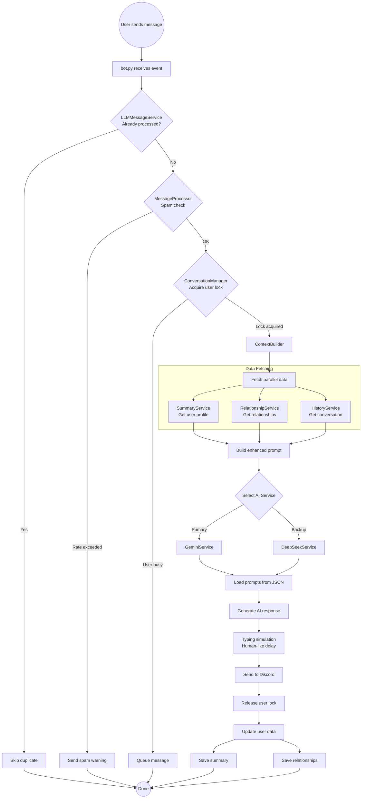

# Discord LLM AI Chatbot

Discord bot powered by Google Gemini and OLLAMA with conversation management, relationship tracking, and user profiling.

## ✨ Current Features

### 🧠 Smart AI Personality & Roleplay

- **Deep Roleplay Engine**: Fully immersive "March 7th" persona (from Honkai: Star Rail) with a distinct Gen Z voice, sassy attitude, and energetic tone. Uses slang and emojis naturally.
- **Adaptive Memory**: The bot learns!. It automatically summarizes user details (name, hobbies, job) from conversations and updates a long-term memory profile.
- **Contextual Awareness**: Understands conversation flow, references to previous messages, and mentioned users. It remembers what you said 5 minutes ago or yesterday.

### 💬 Advanced Conversation Engine

- **Human-like Typing Simulation**: Not just a static delay. The bot calculates reading time + typing speed (WPM) + thinking pauses based on message complexity (emojis, length) to simulate a real person typing.
- **Smart Queue & Anti-Spam**: Intelligent message queuing filters duplicate messages and prevents spam, ensuring stability even in busy channels.
- **Hybrid AI Core**: Seamlessly switches between **Ollama (Local LLM)** for cost-efficiency/privacy and **Google Gemini (Cloud LLM)** for complex reasoning and creative tasks.
- **Smart Addressing**: Intelligently identifies users by their Discord display name if a real name isn't provided, making interactions feel personal and avoiding generic responses.

### 🤝 Social Intelligence (Relationship System)

- **Dynamic Relationship Tracking**: Quantifies relationships based on interaction frequency and sentiment. The bot knows if you are a "bestie" or just an acquaintance.
- **Social Graph Awareness**: Understands the web of relationships in the server (who talks to whom).
- **Sentiment Memory**: Remembers how you treated it in the past and adjusts its attitude accordingly.

### 🛠️ Technical Highlights

- **Modular Architecture**: Built with a clean Service-Repository pattern for easy maintenance, testing, and scalability.
- **Asynchronous Core**: Fully async Python (`discord.py` + `aiohttp`) for high performance and responsiveness.
- **Robust Error Handling**: Self-healing mechanisms for API failures and network issues.

## Message Flow



## Design Patterns

| Pattern | Implementation | Purpose |
|---------|----------------|---------|
| Repository | `SummaryDataManager`, `RelationshipDataManager` | Abstract JSON file I/O operations |
| Service Layer | `SummaryService`, `RelationshipService` | Business logic and orchestration |
| Parser | `SummaryParser` | Pure text transformation without I/O |
| Command (Cog) | `QueueCommands`, `TypingCommands` | Modular Discord commands |
| Pipeline | Message processing chain | Sequential message handling |
| Singleton | `Config` | Centralized configuration |

## Project Structure

```
src/
├── bot.py                          # Entry point, Cog auto-discovery
├── config/
│   ├── settings.py                 # Config class with pathlib paths
│   └── logging_config.py           # Logging setup
├── data/
│   ├── prompts/                    # AI prompt templates (JSON)
│   ├── user_summaries/             # User profiles (gitignored)
│   └── relationships/              # Relationship data (gitignored)
├── services/
│   ├── ai/
│   │   ├── gemini_service.py       # Gemini API integration
│   │   └── deepseek_service.py     # DeepSeek API integration
│   ├── commands/
│   │   ├── queue_commands.py       # Queue management commands
│   │   └── typing_commands.py      # Typing simulation commands
│   ├── conversation/
│   │   ├── conversation_manager.py # Per-user locking
│   │   ├── message_processor.py    # Anti-spam
│   │   └── anti_spam_service.py    # Rate limiting
│   ├── messeger/
│   │   ├── llm_message_service.py  # Message deduplication
│   │   ├── context_builder.py      # Context assembly
│   │   └── message_queue.py        # Message queuing
│   ├── relationship/
│   │   ├── relationship_service.py # Relationship business logic
│   │   └── relationship_data.py    # Repository for relationships
│   └── user_summary/
│       ├── summary_service.py      # Summary business logic
│       ├── summary_data.py         # Repository for summaries
│       └── summary_parser.py       # Text parsing utilities
└── tests/                          # pytest test suite (146 tests)
```

## Quick Start

```bash
# Clone and setup
git clone <repository-url>
cd discord-bot-gemini
python -m venv venv
venv\Scripts\activate  # Windows
# source venv/bin/activate  # macOS/Linux

# Install dependencies
pip install -r requirements.txt

# Configure environment
cp .env.example .env
# Edit .env with your API keys

# Run
python src/bot.py
```

## Environment Variables

| Variable | Required | Description |
|----------|----------|-------------|
| `DISCORD_LLM_BOT_TOKEN` | Yes | Discord bot token |
| `GEMINI_API_KEY` | Yes | Google Gemini API key |
| `DEEPSEEK_API_KEY` | No | DeepSeek API key (backup) |
| `LLM_MODEL` | No | Model name (default: gemini-2.0-flash) |
| `ENABLE_TYPING_SIMULATION` | No | Enable typing delays (default: 1) |
| `TYPING_SPEED_WPM` | No | Words per minute (default: 250) |

## Bot Commands

| Command | Description |
|---------|-------------|
| `!ping` | Test bot responsiveness |
| `!status` | Check bot status and user info |
| `!relationships [user]` | View user relationships |
| `!queue_status` | Show message queue status |
| `!test_typing` | Test typing simulation |

## 🚀 Future Updates & Roadmap

This project is currently a **DEMO** version, showcasing the potential of LLM-powered Discord bots. The long-term vision is to build a comprehensive **AI Agent Platform** where users can deploy and customize their own agents.

### Upcoming Features

#### 🎵 Natural Music Interaction

- **No more slash commands!** Just ask the bot naturally:
  - "Ê bật bài Em Của Ngày Hôm Qua đi"
  - "Thôi bài này chán quá, đổi bài khác sôi động hơn coi"
  - "Tắt nhạc đi ngủ đây"
- The bot will understand context and intent to control music playback.

#### 🛡️ Server Administration

- Intelligent server management and moderation.
- Automated rule enforcement and user support.

#### 🎨 Creative Capabilities

- **Image Generation**: "Vẽ cho tui con mèo đang code error đi" -> Generates image on the fly.
- **Event Management**: "Tạo event tối nay 8h anh em vào chiến game nha" -> Bot automatically sets up Discord event, sends notifications, and manages RSVPs.

### 🌟 The Big Picture: Custom Agent Platform

The ultimate goal is to evolve this bot into a platform where:

- Users can **custom their own Agents** via a Discord App.
- **Prompt Engineering**: Users define their agent's personality, knowledge base, and rules.
- **Configuration**: Set up specific capabilities/tools for each agent.
- **Deployment**: Invite these custom agents to your own servers for specific purposes (Customer Support, Gaming Buddy, Moderator, etc.).

## 🤝 Contribution

We are looking for contributors to help build this vision! If you are interested in AI, Discord Bots, and building cool stuff, join us.

**Contact:**

- 📧 Email: <hoaf.n.v@gmail.com>
- 📘 Facebook: [facebook.com/hoaf.n.v](https://facebook.com/hoaf.n.v)

## License

MIT License - see LICENSE file for details.
