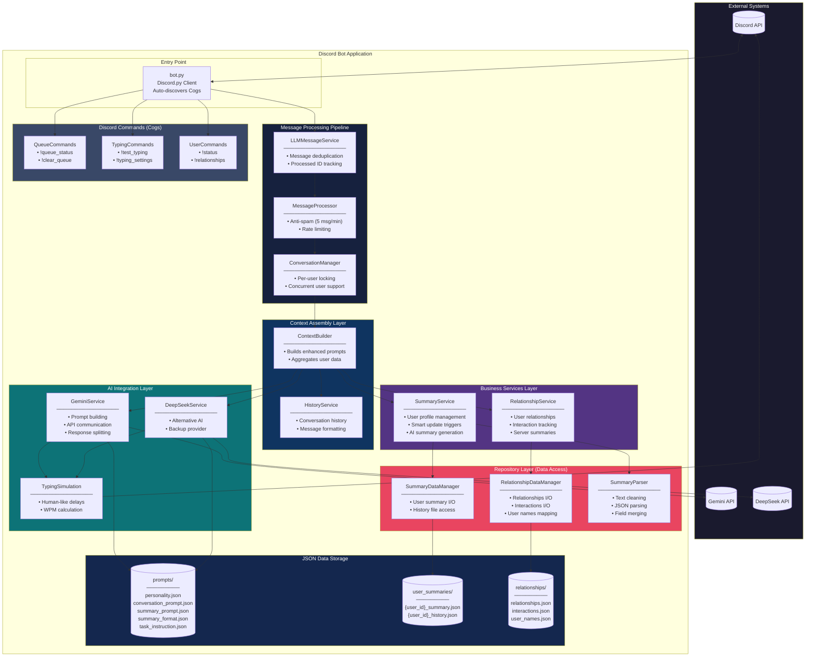
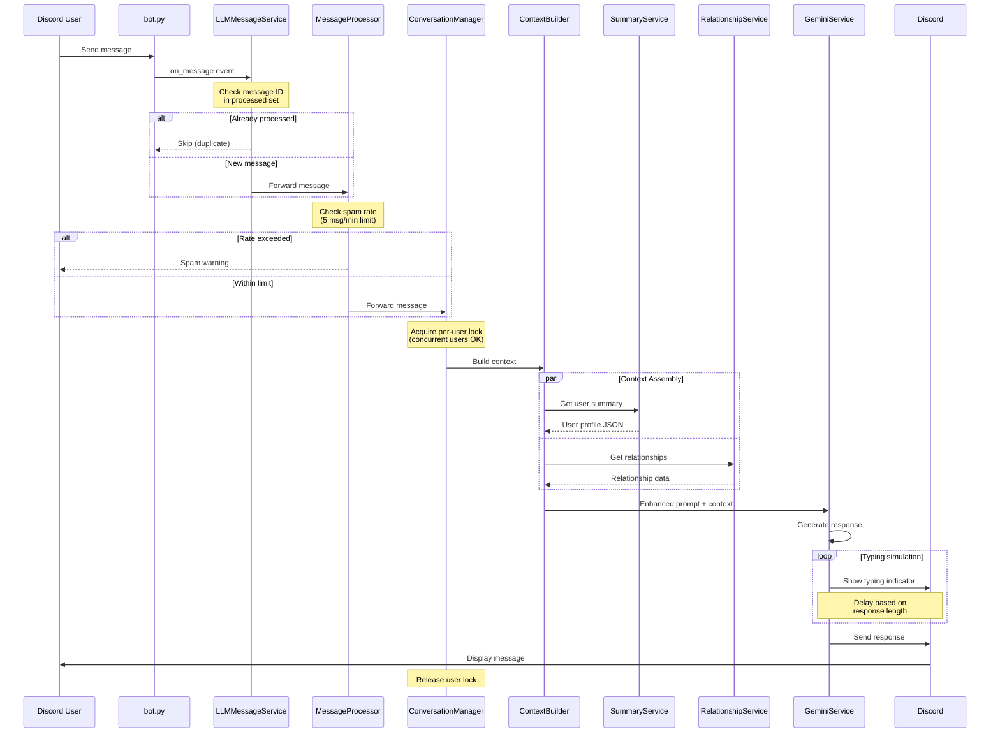

# Discord LLM AI Chatbot

Discord bot powered by Google Gemini and DeepSeek AI with conversation management, relationship tracking, and user profiling.

## High-Level Architecture



## Message Flow Sequence



## Design Patterns

| Pattern | Implementation | Purpose |
|---------|----------------|---------|
| Repository | `SummaryDataManager`, `RelationshipDataManager` | Abstract JSON file I/O operations |
| Service Layer | `SummaryService`, `RelationshipService` | Business logic and orchestration |
| Parser | `SummaryParser` | Pure text transformation without I/O |
| Command (Cog) | `QueueCommands`, `TypingCommands` | Modular Discord commands |
| Pipeline | Message processing chain | Sequential message handling |
| Singleton | `Config` | Centralized configuration |

## Project Structure

```
src/
├── bot.py                          # Entry point, Cog auto-discovery
├── config/
│   ├── settings.py                 # Config class with pathlib paths
│   └── logging_config.py           # Logging setup
├── data/
│   ├── prompts/                    # AI prompt templates (JSON)
│   ├── user_summaries/             # User profiles (gitignored)
│   └── relationships/              # Relationship data (gitignored)
├── services/
│   ├── ai/
│   │   ├── gemini_service.py       # Gemini API integration
│   │   └── deepseek_service.py     # DeepSeek API integration
│   ├── commands/
│   │   ├── queue_commands.py       # Queue management commands
│   │   └── typing_commands.py      # Typing simulation commands
│   ├── conversation/
│   │   ├── conversation_manager.py # Per-user locking
│   │   ├── message_processor.py    # Anti-spam
│   │   └── anti_spam_service.py    # Rate limiting
│   ├── messeger/
│   │   ├── llm_message_service.py  # Message deduplication
│   │   ├── context_builder.py      # Context assembly
│   │   └── message_queue.py        # Message queuing
│   ├── relationship/
│   │   ├── relationship_service.py # Relationship business logic
│   │   └── relationship_data.py    # Repository for relationships
│   └── user_summary/
│       ├── summary_service.py      # Summary business logic
│       ├── summary_data.py         # Repository for summaries
│       └── summary_parser.py       # Text parsing utilities
└── tests/                          # pytest test suite (67 tests)
```

## Quick Start

```bash
# Clone and setup
git clone <repository-url>
cd discord-bot-gemini
python -m venv venv
venv\Scripts\activate  # Windows
# source venv/bin/activate  # macOS/Linux

# Install dependencies
pip install -r requirements.txt

# Configure environment
cp .env.example .env
# Edit .env with your API keys

# Run
python src/bot.py
```

## Environment Variables

| Variable | Required | Description |
|----------|----------|-------------|
| `DISCORD_LLM_BOT_TOKEN` | Yes | Discord bot token |
| `GEMINI_API_KEY` | Yes | Google Gemini API key |
| `DEEPSEEK_API_KEY` | No | DeepSeek API key (backup) |
| `LLM_MODEL` | No | Model name (default: gemini-2.0-flash) |
| `ENABLE_TYPING_SIMULATION` | No | Enable typing delays (default: 1) |
| `TYPING_SPEED_WPM` | No | Words per minute (default: 250) |

## Bot Commands

| Command | Description |
|---------|-------------|
| `!ping` | Test bot responsiveness |
| `!status` | Check bot status and user info |
| `!relationships [user]` | View user relationships |
| `!queue_status` | Show message queue status |
| `!test_typing` | Test typing simulation |

## Testing

```bash
python -m pytest src/tests -v
# 67 passed in 0.72s
```

| Test File | Coverage |
|-----------|----------|
| `test_summary_data.py` | SummaryDataManager repository |
| `test_summary_parser.py` | SummaryParser transformations |
| `test_relationship_data.py` | RelationshipDataManager repository |
| `test_queue_commands.py` | QueueCommands Cog |
| `test_typing_commands.py` | TypingCommands Cog |
| `test_prompts.py` | Prompt file validation |

## Security

- `.env` is gitignored - never commit API keys
- Pre-commit hooks scan for secrets
- User data directories are gitignored

```bash
# Enable git hooks
powershell -ExecutionPolicy Bypass -File scripts\enable_git_hooks.ps1
```

## License

MIT License - see LICENSE file for details.
