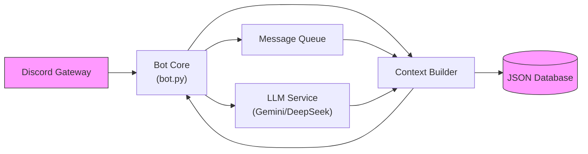

# Discord LLM AI Chatbot

A sophisticated Discord bot powered by Google's Gemini and DeepSeek AI models, featuring intelligent conversation management, relationship tracking, user summaries, and anti-spam protection.

## ✨ Features

- **Multi-Model AI Support**: Integrates Gemini 2.0 Flash and DeepSeek AI for diverse response capabilities
- **Contextual Responses**: Maintains conversation history and user summaries for personalized interactions
- **Intelligent Relationships**: Tracks and analyzes user relationships with natural language recognition
- **User Profiling**: AI-generated summaries of user interactions and profiles stored as JSON
- **Conversation Management**: Anti-spam protection, message queuing, and sequential response handling
- **Typing Simulation**: Realistic typing delays to mimic human-like responses
- **Admin Controls**: Channel-based bot configuration and user commands

## 🏗️ Project Structure

```
src/
├── bot.py                        # Main bot entry point
├── config/                       # Configuration & logging
├── data/
│   ├── prompts/                  # AI prompt templates (JSON format)
│   ├── config/                   # Configuration files
│   └── user_summaries/           # User profile data (JSON format)
├── models/                       # Data models (User, Channel, Conversation)
├── services/
│   ├── ai/                       # LLM integrations (Gemini, DeepSeek)
│   ├── channel/                  # Channel management
│   ├── conversation/             # Message processing & anti-spam
│   ├── messeger/                 # Message queue & context building
│   ├── relationship/             # Relationship tracking
│   ├── user/                     # User commands
│   └── user_summary/             # User profiling & summary generation
├── utils/                        # Helper utilities
├── tests/                        # Test suite
└── requirements.txt              # Python dependencies
```
## 🗺️ Architecture



### Message Flow

1. **Message Reception**: Bot listens for messages in configured channels
2. **Deduplication**: `MessageProcessor` prevents duplicate processing
3. **Context Building**: Gathers user history, relationships, and conversation context
4. **AI Processing**: Sends enhanced prompt to Gemini/DeepSeek API
5. **Response Generation**: Streams response with optional typing simulation
6. **Data Updates**: Updates user summaries and relationship data (JSON format)

## 🚀 Quick Start

### Prerequisites

- Python 3.8+
- Discord Bot Token
- Google Gemini API Key (optional, for enhanced AI)
- DeepSeek API Key (optional, for alternative AI)

### Installation Steps

1. **Clone and set up environment:**

   ```bash
   git clone <repository-url>
   cd discord-bot-gemini
   python -m venv venv
   # On Windows: venv\Scripts\activate
   # On macOS/Linux: source venv/bin/activate
   ```

2. **Install dependencies:**

   ```bash
   pip install -r requirements.txt
   ```

3. **Create `.env` file:**

   ```env
   DISCORD_LLM_BOT_TOKEN=your_token_here
   GEMINI_API_KEY=your_gemini_key_here
   DEEPSEEK_API_KEY=your_deepseek_key_here
   LLM_MODEL=gemini-2.0-flash
   ENABLE_TYPING_SIMULATION=1
   TYPING_SPEED_WPM=250
   ```

4. **Run the bot:**

   ```bash
   python src/bot.py
   ```

### Optional: Hardware Acceleration

For GPU support, install the appropriate requirements for your hardware:

```bash
# NVIDIA CUDA
pip install -r requirements-gpu-cuda.txt

# AMD ROCm
pip install -r requirements-gpu-rocm.txt

# Intel GPU
pip install -r requirements-gpu-intel.txt

# All optional dependencies
pip install -r requirements-all.txt
```

## 📖 Usage

### Bot Commands

| Command | Description |
|---------|-------------|
| `!ping` | Test bot responsiveness |
| `!status` | Check bot status and user info |
| `!relationships [user]` | View user relationships |
| `!conversation user1 user2` | Get conversation summary |
| `!analysis [user]` | AI relationship analysis |
| `!all_users` | Admin: View all users summary |

### Configuration Reference

| Environment Variable | Description | Default |
|----------------------|-------------|---------|
| `DISCORD_LLM_BOT_TOKEN` | Discord bot token | Required |
| `GEMINI_API_KEY` | Google Gemini API key | Optional |
| `DEEPSEEK_API_KEY` | DeepSeek API key | Optional |
| `LLM_MODEL` | AI model to use | `gemini-2.0-flash` |
| `ENABLE_TYPING_SIMULATION` | Enable typing delays | `1` |
| `TYPING_SPEED_WPM` | Words per minute for typing | `250` |

## 🔧 Development & Testing

### Running Tests

```bash
pytest -q
```

### Test Suite Coverage

- **test_summary_update.py** - Verifies LLM JSON responses are preserved and fields updated
- **test_duplicate_messages.py** - Confirms duplicate message prevention works
- **test_concurrency.py** - Validates concurrent message handling (60+ messages)
- **test_stress.py** - 200+ message throughput test
- **test_error_handling.py** - Verifies graceful LLM error recovery

All tests passing: `6 passed in 0.49s`

## 🔐 Security & Secret Protection

### Protecting API Keys

1. **`.env` file is git-ignored** - Never commit `.env` to the repository
2. **Pre-commit hooks scan for secrets** - Automatically block commits with API keys
3. **Helper scripts for cleanup** - Remove accidentally tracked files

### Enable Git Hooks

```bash
# Linux / macOS
bash scripts/enable_git_hooks.sh

# Windows (PowerShell)
powershell -ExecutionPolicy Bypass -File scripts\enable_git_hooks.ps1
```

### Check for Tracked Secrets

```bash
# Linux / macOS
bash scripts/check_tracked_sensitive_files.sh

# Windows (PowerShell)
powershell -ExecutionPolicy Bypass -File scripts\check_tracked_sensitive_files.ps1
```

### Remove Accidentally Committed `.env`

```bash
# Linux / macOS
bash scripts/remove_sensitive_files.sh

# Windows (PowerShell)
powershell -ExecutionPolicy Bypass -File scripts\remove_sensitive_files.ps1
```

## 📚 Additional Documentation

- **[BOT_USAGE_GUIDE.md](BOT_USAGE_GUIDE.md)** - User guide for bot interactions
- **[BOT_CHANNELS_GUIDE.md](BOT_CHANNELS_GUIDE.md)** - Channel configuration guide
- **[RELATIONSHIP_GUIDE.md](RELATIONSHIP_GUIDE.md)** - Relationship system guide
- **[PROJECT_STRUCTURE.md](PROJECT_STRUCTURE.md)** - Detailed project structure
- **[TYPING_SIMULATION_GUIDE.md](TYPING_SIMULATION_GUIDE.md)** - Typing simulation details

## 📄 License

This project is licensed under the MIT License - see the LICENSE file for details.

## 🙏 Acknowledgments

- Google Gemini API for AI capabilities
- DeepSeek for alternative AI models
- Discord.py for the Discord bot framework
