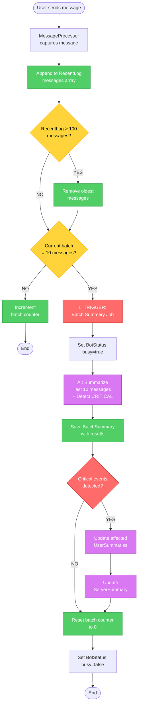
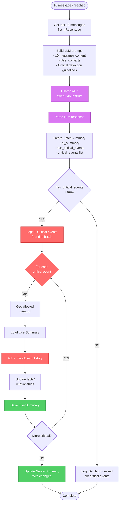
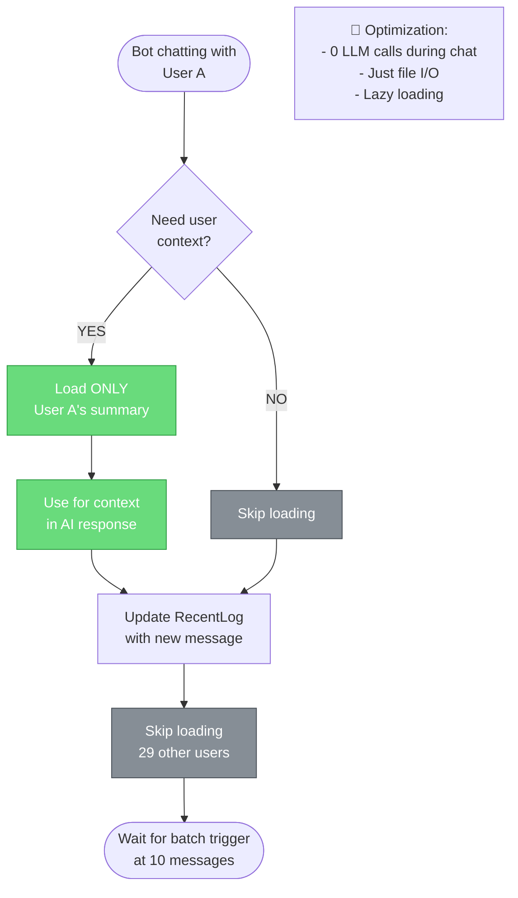
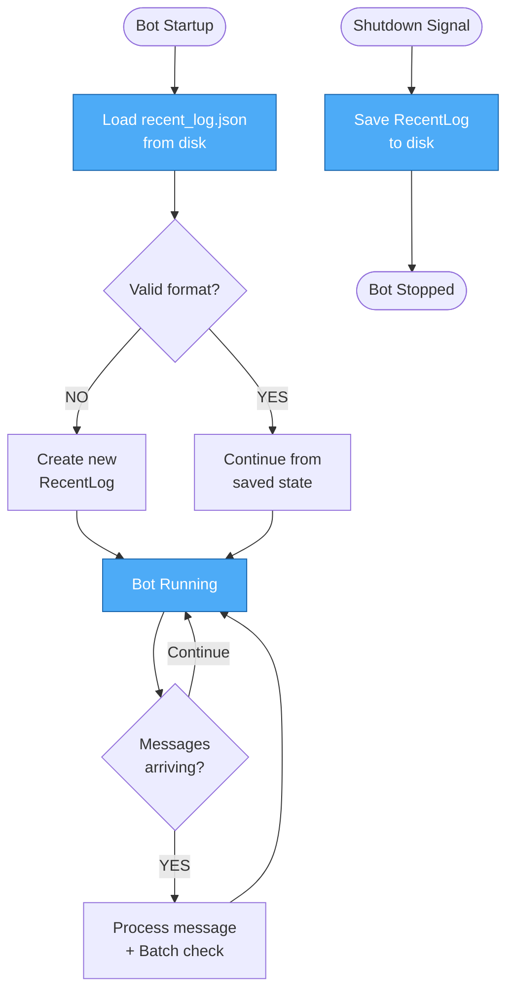

# V2.0 Activity Diagram - RecentLog + Batch Processing

**Based on:** Real-time batch processing every 10 messages (No scheduled jobs!)

## 🔄 Main Message Flow (Real-time Batch Processing)



## 📦 Batch Summary Process (Detail)



## 💬 Per-User Optimization (Conversation Mode)



## 📊 RecentLog Lifecycle



## 🤖 LLM Critical Detection Logic

```
During batch processing (every 10 messages):

Input to LLM:
- Last 10 messages with full content
- User contexts for participants  
- Critical event guidelines

LLM Task:
1. Summarize batch (what happened overall)
2. Detect if any CRITICAL events occurred
   Examples:
   - Relationship changes (marriage, breakup, new love)
   - Life events (job change, moving, graduation)
   - Community impact (major conflicts, user leaving)
   - Personality shifts (dramatic mood/behavior changes)

Output JSON:
{
  "batch_summary": "Users discussed bot development...",
  "has_critical_events": true/false,
  "critical_events": [
    {
      "user_id": "123",
      "event_type": "life_event",
      "summary": "User started new job",
      "confidence": 0.9,
      "affected_users": []
    }
  ]
}

Benefits:
✅ 10-message context (enough for detection)
✅ Real-time (max 10 msg delay = ~5 minutes typically)
✅ No keyword maintenance
✅ AI understands nuance
✅ Event-driven (no wasted processing)
```

## 📊 Data Flow Simplified

```
Messages → RecentLog (sliding window 100)
           ↓ (every 10 messages)
         LLM Batch Summary
           ↓ (if critical detected)
      UserSummary + ServerSummary
```

**Storage:**
- Temporary: RecentLog (100 messages, rolling)
- Permanent: UserSummary.critical_events[]
- Permanent: ServerSummary

---

## 📝 Key Benefits

✅ **Simple:** 1 file, 1 trigger, 0 scheduled jobs  
